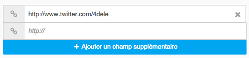

react-dynamic-fields
=====================

A ReactJS component to add new input fields dynamically.

Getting started:
---------------------

##### Install:

`npm install react-dynamic-fields`

##### To load the component:

`var DynamicFields = require("react-dynamic-fields");`

Example:
---------------------

Open the 'index.html' file from the 'sample' folder into your browser to see an example of usage.
